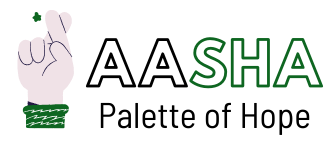

## Introduction
Aasha mainly focuses on supporting and finding investors for people who want to start small scale businesses but do not have enough capital to set it up.
The Investee can apply to get listed and then investors could see the profiles of the investees and decide where to invest.
In these hard times, we are setting up a covid donation and resources plan to help people in need.

A peer-to-peer lending platform where investees can get investors to fund their small scale businesses.
Aasha mainly focuses on supporting and finding investors for people who want to start small scale businesses but do not have enough capital to set it up.
The Investee can apply to get listed and then investors could see the profiles of the investees and decide where to invest.
In these hard times, we are setting up a covid donation and resources plan to help people in need.

## Technology Stack
<ul>
  <li>HTML</li>
  <li>CSS</li>
  <li>Bootstrap</li>
  <li>Javascript</li>
  <li>NodeJs</li>
  <li>Firebase</li>
</ul>

## Website Demo
[Aasha-Palette of Hope](https://aasha-node.herokuapp.com/ "Aasha's Homepage")

## Presentation
[Link](https://www.canva.com/design/DAEfLj9yIOI/zFC1xRYSt54Ixumzq8FQJQ/view?utm_content=DAEfLj9yIOI&utm_campaign=designshare&utm_medium=link&utm_source=publishsharelink "Aasha's PPT")

## Contributors
### Team Name: Nostros Codinger
  1. Shruti Mayank
  2. Shruti Varshney
  3. Prashant Singh
  4. Abhishek Singh Sankhla

                                               
